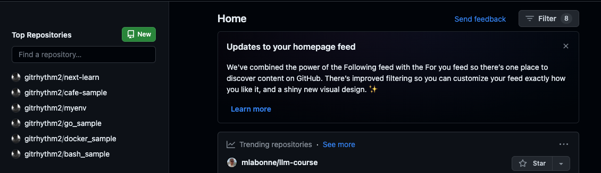
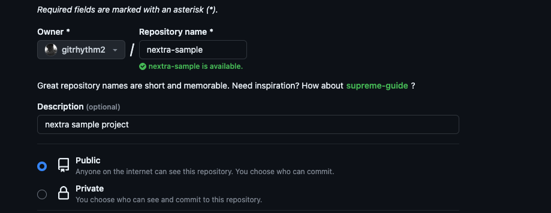
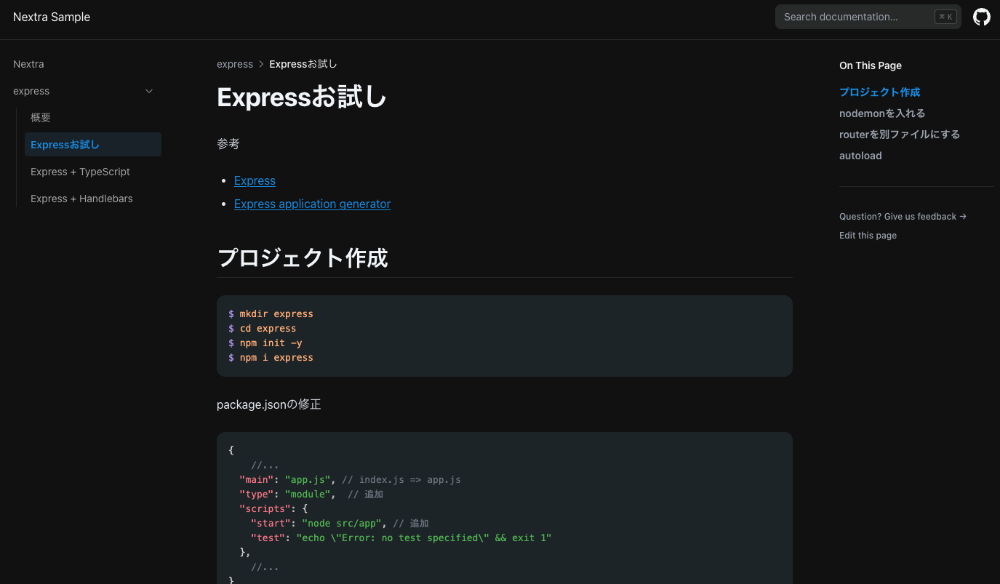
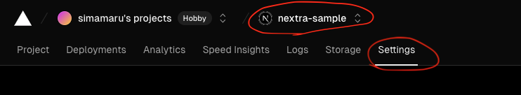
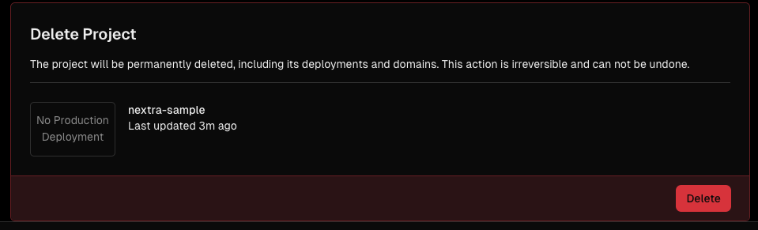
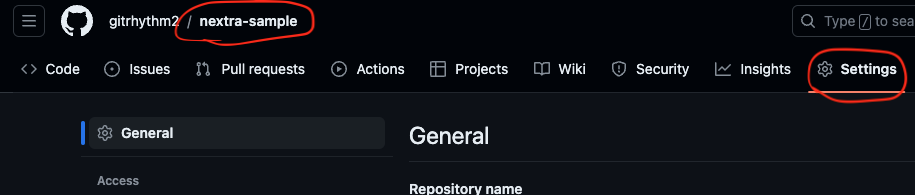
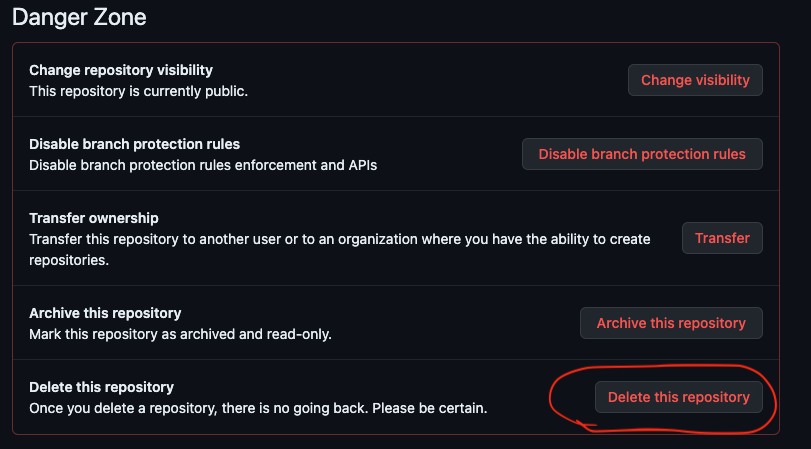

[nextra](https://nextra.site/)と[Startlight](https://starlight.astro.build/ja/)をざっと試してみた結果、nextraの方が印象が良かったのでこちらでドキュメントサイト構築を試してみる。

> Startlightは高機能で設定も柔軟な印象だけど、サブドキュメントの設定の仕方が良くわからなかったのと、nextraの_meta.jsonでディレクトリ単位で設定する方法の方が個人的に好みだった。

参考
- [nextra](https://nextra.site/)
- [nextra | GitHub](https://github.com/shuding/nextra)
- [Nextra + Amplifyでさくっとオンラインマニュアルサイトを立ち上げる](https://zenn.dev/ashizaki/articles/1f39fa156d867e)
- [Nextraの実装を理解してドキュメントサイト以外に利用できるようになる](https://zenn.dev/soata/articles/085fcf674a8978#nextra%E3%81%A8%E3%81%AF)

## 新規プロジェクト作成
### インストール
[Docs Theme | Get Started](https://nextra.site/docs/docs-theme/start) にはGitHubに上がっているTemplateをcloneする方法も紹介されているが、[Start as New Project](https://nextra.site/docs/docs-theme/start#start-as-new-project) の方法を参考に新規プロジェクトを作成する。

まずはNext.jsのプロジェクトを作成する。
nextraはApp Routerに対応していないので、App RouterはNoを選択する。
```shell
$ npx create-next-app@latest --src-dir --ts --eslint -- import-alias "@/*"

? Would you like to use Tailwind CSS? › No / Yes # => No
? Would you like to use App Router? (recommended) › No / Yes # => No
```

そして追加でnextraのパッケージをインストール。
```shell
$ npm i nextra nextra-theme-docs
```

### 設定
next.config.jsを以下に変更する。
```js
const withNextra = require('nextra')({
  theme: 'nextra-theme-docs',
  themeConfig: './theme.config.tsx'
})

module.exports = withNextra()
```

ルート直下にtheme.config.tsxを作成し、以下を追加。
```ts
import { DocsThemeConfig } from "nextra-theme-docs";

const config: DocsThemeConfig = {
  logo: <span>Nextra Sample</span>,
  project: {
    link: 'http://localhost:3000',
  }
}

export default config
```

## 不要なコードを削除
Next.jsプロジェクトを作成すると通常のSPAなプロジェクトを生成するけど、nextraではjsxファイルは不要なのでpages配下の以下のファイルを削除する。
- \_app.tsx
- \_document.tsx
- index.tsx

加えて、pages/apiも不要なので削除する。
そして、style.globals.cssを以下に変更する。
```css
@tailwind base;
@tailwind components;
@tailwind utilities;
```

## トップページを作る
pages/index.mdxを作り、タイトルだけ入れておく。
```md
# インデックスページ
```

`npm run dev`で起動し、インデックスページが表示されればOK。

## ページを作ってみる
まずはインプルに`/`、`/contact`、`/about`ページを作る。
`/`はindex.mdとして既に作成済みなので、残りの2つのページを作る。
pages/contact.mdx
```md
# Contact Page
```

pages/about.mdx
```md
# About Page
```

これらを追加するとナビゲーションエリアにメニューが追加される。
メニューに表示する文字列はファイル名を元にパスカルケースにしたり、ケバブケースの`-`をスペースに変換するなりして表示している。
表示の順番は文字列を昇順でソートしたものになっているので、[Page Configuration | Pages](https://nextra.site/docs/docs-theme/page-configuration#pages)を参考にこれらを設定で調整する。

pages/\_meta.jsonファイルを作成し、以下を追加する。
```json
{
  "index": "ホーム",
  "contact": "コンタクト",
  "about": "私たちについて"
}
```

これでメニュー項目の表示順や、表示する文字列をカスタマイズ出来た。

ヘッダー部左のタイトル`Nextra Sample`をクリックしてもインデックスページに遷移するので、ナビゲーションメニューの`ホーム`は非表示にしたい。そのためにはdisplayにhiddenを指定する。[Hidden Routes](https://nextra.site/docs/docs-theme/page-configuration#hidden-routes)

```json
{
  "index": {
    "display": "hidden"
  },
  "contact": "コンタクト",
  "about": "私たちについて"
}
```

### ドキュメントの階層化
添付画像のように、メニューを階層化したい。

nextraはNext.jsのアプリケーションなので、通常のNext.jsのページを作成する要領でディレクトリを階層化してページを作れば良い。
```
src/pages
    |- frameworks
         |- _meta.json
         |- react.md
         |- svelte.md
         |- vue.md
```

そしてframeworksディレクトリにも`\_meta.json`を作る。
```json
{
  "react": "React",
  "---": {   # セパレータを入れる場合はこのようにする
    "type": "separator"
  },
  "svelte": "Svelte",
  "vue": "Vue"
}
```

### サブドキュメントを追加
例えばドキュメントサイトとして`direct`があり、`backdirect`と`frontdirect`のドキュメントを管理し、ヘッダー部にサブドキュメントのメニューを表示したいとする。


この場合はルート直下の\_meta.jsonにその設定を追加してあげる。
ここまで作成したページは不要なので、`contact.md`、`about.md`、`frameworks`ディレクトリを削除する。その上で、次のページを追加する。

```
src/pages
    |- backdirect
         |-overview.mdx
    |- frontdirect
         |- overview.mdx
```

\_meta.jsonにこれらのディレクトリ情報をオブジェクトとして追加する。
```json
{
  "index": {
    "display": "hidden"
  },
  "backdirect": {
    "title": "backdirect",
    "type": "page"
  },
  "frontdirect": {
    "title": "frontdirect",
    "type": "page"
  }
}
```

このようにすれば、backdirectとfrontdirectがヘッダー部に表示される。

### イメージファイルの表示
イメージファイルの表示は、通常のNext.jsアプリと同じ考え方になる。つまり、publicディレクトリにイメージファイルを置き、そのファイルをページ側で参照する形になる。

```
public
 |- frontdirect
      |- dir.png
```

ページ側
```ts


//または、next/imageを使う

import Image from 'next/image'
<Image src="/frontdirect/overview/dir.png" alt="Hello" width={350} height={350} />
```

## ファイルの編集方法
nextraはマークダウンファイルを表示することに特化していて編集機能は提供していない。したがってマークダウンファイルの編集は別途考えなければならない。

### 開発モードで編集
nextraプロジェクトを`npm run dev`で立ち上げると開発モードで起動し、ファイルを編集する都度画面が更新されるので、ドキュメントを修正する場合はこの方法で修正すると、都度表示結果を確認できる。

### GitLabと連携
後で書く・・・

## Vercelにデプロイする
参考: [Next.jsアプリをVercelにデプロイする](https://zenn.dev/dollaga_saiore/articles/2b9158e5add3c6)

### GitHubにプロジェクト作成
前提: GitHubにアカウントがある

まず最初にGitHubにリポジトリを作成する。
`https://github.com/dashboard`にアクセスし、Newボタンをクリック。



リポジトリ名を入力する。


Public / Privateはお好みで。
その他READMEの追加や.gitinogreの追加は、pushしようとしているローカルのnextraプロジェクトに既に存在しているので、これらは作成しないでおく。

`Create repository`ボタンでリポジトリ作成。

#### 作成したプロジェクトにpush
リポジトリを作成するとnextra-sampleプロジェクトのページに遷移する。
pushしようとするプロジェクトは既にローカルに存在しているので、`### …or push an existing repository from the command line`の手順を実行する。
```
git remote add origin https://github.com/gitrhythm2/nextra-sample.git
git branch -M main
git push -u origin main
```

### GitHub - Vercelの連携
GitHubの[Settings]ページを開き、`Integrations - Applications`をクリック。


下図の画面に遷移するので、Vercelの`Configure`ボタンをクリック。
> 以前Vercelに別プロジェクトをデプロイしたことがあるので、ここにVercelが表示されているのかも知れない。
> もし表示されないならば、GitHub / Vercel連携をググってみること、何か情報が出てくるかも？


`Repository access`の`Only select repositories`から`nextra-sample`を選択する。


`Save`ボタンをクリックして完了。

### Vercel側の操作
> Vercelにアカウント作成済みであることを前提として話を進める。

https://vercel.com にアクセスし、`Add New...`ボタンから`Project`を選択する。


`Let's build something new.`ページに遷移し、nextra-sampleが候補としてリストアップされている。


`Import`ボタンをクリックすると`Configure Project`画面に遷移する。
特に変更する項目も無いので`Deploy`ボタンをクリックしてデプロイする。


以下のページが表示されればOK。
赤丸の部分をクリックするとデプロイしたページを表示することが出来る。


デプロイしたページ: https://nextra-sample-navy.vercel.app/express/trial


## 削除
Vercelにデプロイしたnextra-sampleの削除、及びGitHubリポジトリの削除をしてみる。

### デプロイの停止
Vercelにデプロイしたnextra-sampleを停止するには以下の操作をする。

https://vercel.com にアクセスし、nextra-sampleを選択。


デプロイ情報画面に遷移するので、`Deployments`タブをクリックし、デプロイしたアプリを選択。
下図の`Delete`を選択。


>再度デプロイするためには、一旦GitHub側のソースコードを変更しないといけないっぽい(他に方法があるかも知れないけど)
>ようは、
>- ローカルでソースコードを変更
>- Pushする
> 
> Pushすると、Vercel側で自動でデプロイ処理が走る

### Vercel側のプロジェクトの削除
デプロイを停止後、プロジェクトそのものを削除するには、nextra-sampleのSettingsタブを選択し、画面下部の`Delete Project`で削除する。





### GitHubリポジトリの削除
GitHubのnextra-sampleプロジェクトのSettingsタブを選択し、画面下部の`Delete this repository`で削除する。



