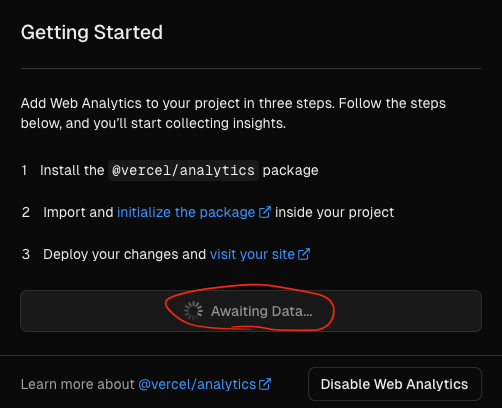

import { Steps } from 'nextra/components'
import { Notis } from '@/components/Notis'

# Analyticsを試す

参考
- [Vercel Web Analytics](https://vercel.com/docs/analytics)
- [Vercel Web Analytics Quickstart](https://vercel.com/docs/analytics/quickstart#)

<Steps>
### `@vercel/analytics`をプロジェクトに追加する
```shell
$ npm i @vercel/analytics
```

### Analyticsコンポーネントをアプリに追加する
```tsx {2,9}
import '@/styles/globals.css'
import { Analytics } from '@vercel/analytics/react'
import type { AppProps } from 'next/app'

export default function App({ Component, pageProps }: AppProps) {
  return (
    <>
      <Component {...pageProps} />
      <Analytics />
    </>
  )
}
```

### アプリをデプロイする
GitHubにプロジェクトをpushしてデプロイする。

デプロイすると先の待ち状態のダイアログが消え、Start exploringボタンが表示されるのでクリックする。
以上でAnalyticsが有効になる。

### Analyticsを有効にする
VercelのサイトでAnalyticsタブを開き、Nextボタンクリックで有効にする。


次の画面でEnableボタンをクリックして有効にする。
有効にするとAnalyticsページが表示される。

<Notis>
デプロイする前にAnalyticsを有効にしようとすると、Nextボタンをクリックした後に下図のようなAwaiting状態になるので、
デプロイ後にAnalyticsを有効にする方が、手順としてはスムーズだと思う。

</Notis>
</Steps>
