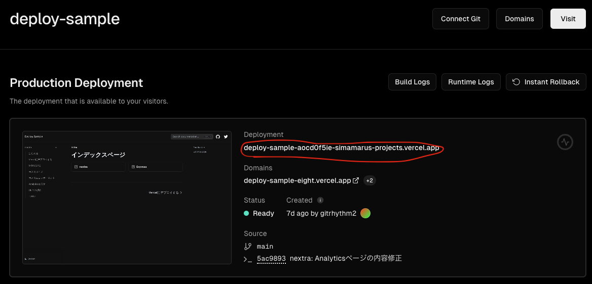

import { Notis } from '@/components/Notis'

# CLIの操作

CLIを使って、Vercelにデプロイしたアプリケーションを操作することができる。

## 準備
### インストール
参考: [Vercel CLI Overview](https://vercel.com/docs/cli)

まず、Vercel CLIをインストールする。
```shell
np i -D vercel@latest
```

### デプロイ
参考: [Deploying Projects from Vercel CLI](https://vercel.com/docs/cli/deploying-from-cli)

#### GitHubプロジェクトの場合
##### ログイン
まずはVercelにログインする。以下のコマンドを実行してログインプロセスを開始する。
GitHubプロジェクトなので、このまま次に進む。

```shell
$ npx vercel login

Vercel CLI 33.3.0
? Log in to Vercel
● Continue with GitHub
○ Continue with GitLab
○ Continue with Bitbucket
○ Continue with Email
○ Continue with SAML Single Sign-On
  ─────────────────────────────────
○ Cancel
```

以下のメッセージが表示されると同時に、メールが送信されて来る。「Verify」をクリックするとログインが完了する。

```shell
? Log in to Vercel github
> Success! GitHub authentication complete for 'your@email'
Congratulations! You are now logged in. In order to deploy something, run `vercel`.
💡  Connect your Git Repositories to deploy every branch push automatically (https://vercel.link/git).
~/p/sample (main|✚9) $ npx vercel login
Vercel CLI 33.3.0
? Log in to Vercel email
? Enter your email address: 'your@email'
We sent an email to 'your@email'. Please follow the steps provided inside it and make sure the security code matches Pleasant Royal Penguin.
> Success! Email authentication complete for 'your@email'
Congratulations! You are now logged in. In order to deploy something, run `vercel`.
💡  Connect your Git Repositories to deploy every branch push automatically (https://vercel.link/git).
```

##### デプロイ
プロジェクトディレクトリに移動して、以下のコマンドを実行してデプロイを開始する。
```shell
$ npx vercel

? Set up and deploy “path-to-project”? [Y/n] 'Y'
? Which scope do you want to deploy to?
● simamaru's projects 'Enter'
? Found project “simamarus-projects/nextra-sample”. Link to it? [Y/n] 'Y'
🔗  Linked to simamarus-projects/nextra-sample (created .vercel)
🔍  Inspect: https://vercel.com/simamarus-projects/nextra-sample/CmUJ1XXXHdLij7ZofNycAutQyyFr [4s]
✅  Preview: https://nextra-sample-i7vkqXXhg-simamarus-projects.vercel.app [4s]
📝  To deploy to production (nextra-sample-chi.vercel.app), run `vercel --prod`
```

以上でデプロイは完了。
Previewに指定されているURLでデプロイされたアプリケーションを確認できる。
この状態は、プロダクション環境にはデプロイされておらず、開発時の確認のためのPreview環境にデプロイされている模様。
最後のコメントにあるように、プロダクション環境にデプロイするには`vercel --prod`を実行する。

#### ローカルプロジェクトの場合
##### ログイン
```shell
$ npx vercel login

Vercel CLI 33.3.0
? Log in to Vercel
○ Continue with GitHub
○ Continue with GitLab
○ Continue with Bitbucket
● Continue with Email  # これを選択
○ Continue with SAML Single Sign-On
  ─────────────────────────────────
○ Cancel
```

ログイン方法を選択する。どことも連携していないプロジェクトなのでEmailを選択する。

```shell
Vercel CLI 33.3.0
? Log in to Vercel email
? Enter your email address: 'your@email' #=> 入力する
We sent an email to 'your@email'. Please follow the steps provided inside it and make sure the security code matches Sunny Sabre-Toothed Tiger.
> Success! Email authentication complete for 'your@email'
Congratulations! You are now logged in. In order to deploy something, run `vercel`.
💡  Connect your Git Repositories to deploy every branch push automatically (https://vercel.link/git).
```

メールアドレスを入力すると、以下のメッセージが表示されると同時にメールが送信されて来る。
「Verify」をクリックするとログインが完了する。

##### デプロイ
プロジェクトディレクトリに移動して、以下のコマンドを実行してデプロイを開始する。いくつか質問してくるので、適宜回答する。

```shell
 $ npx vercel
Vercel CLI 33.3.0
? Set up and deploy “~/prj/sample”? [Y/n] y
? Which scope do you want to deploy to? simamaru's projects
? Link to existing project? [y/N] n            #=> 初回の新規プロジェクトなのでnを選択
? What’s your project’s name? deploy-sample    #=> プロジェクト名を入力
? In which directory is your code located? ./
Local settings detected in vercel.json:
Auto-detected Project Settings (Next.js):
- Build Command: next build
- Development Command: next dev --port $PORT
- Install Command: `yarn install`, `pnpm install`, `npm install`, or `bun install`
- Output Directory: Next.js default
? Want to modify these settings? [y/N] n       #=> デフォルトのままでOKなのでnを選択
🔗  Linked to simamarus-projects/deploy-sample (created .vercel)
🔍  Inspect: https://vercel.com/simamarus-projects/deploy-sample/Ds8aQxxDinRDkS98BWxJkgh7YQyQ [1s]
✅  Production: https://deploy-sample-hti6xxef6-simamarus-projects.vercel.app [1s]
📝  Deployed to production. Run `vercel --prod` to overwrite later (https://vercel.link/XX).
💡  To change the domain or build command, go to https://vercel.com/simamarus-projects/deploy-sample/settings
```

以上でデプロイは完了。

<Notis>
  Productionモードでデプロイする場合は`--prod`オプションをつける。
  - Previewモードでのデプロイ: `vercel`
  - Productionモードでのデプロイ: `vercel --prod`
</Notis>

<Notis type="caution">
  どちらでデプロイしてもルートディレクトリに`.vercel`というディレクトリが作成される。
  .vercel/README.txtにも書いてあるが、このディレクトリはgitでは管理しないようにする。
</Notis>

### その他の操作
#### デプロイしている一覧表示(vercel list)
デプロイされているものの一覧を表示する。
```shell
$ npx vercel list  # listはlsでもOK
  Age     Deployment                      Status  Environment Duration Username
  7d      https://deploy-xxxxx.vercel.app ● Ready Production  40s      user
  7d      https://deploy-xxxxx.vercel.app ● Ready Production   1m      user
```
ここに表示されているものはVercelのダッシュボード上で確認できるものと同じだが、Deploymentに
表示されているものがここに表示される。Domainsで示されているURLは出てこない。


#### デプロイの停止(remove -save)
参考: [Vercel CLI - remove](https://vercel.com/docs/cli/remove)

`vercel list`で確認したURLを指定すると、そのURLのデプロイを停止する。
```shell
$ npx vercel remove [デプロイURL]  # removeはrmでもOK
```

#### プロジェクトの削除(remove)
プロジェクト名を指定すると、プロジェクトそのものをvercelから削除する。
```shell
$ npx vercel remove [プロジェクト名] # removeはrmでもOK
```
