import { Notis } from '@/components/Notis'

# Vercelにデプロイする
参考: [Next.jsアプリをVercelにデプロイする](https://zenn.dev/dollaga_saiore/articles/2b9158e5add3c6)

## GitHubにプロジェクト作成
<Notis>
  GitHubにアカウントがあることを前提として話を進める。
</Notis>

まず最初にGitHubにリポジトリを作成する。
`https://github.com/dashboard`にアクセスし、Newボタンをクリック。

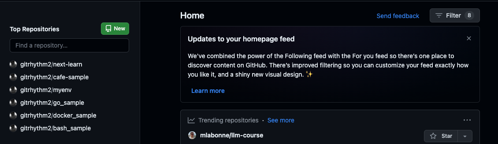

リポジトリ名を入力する。
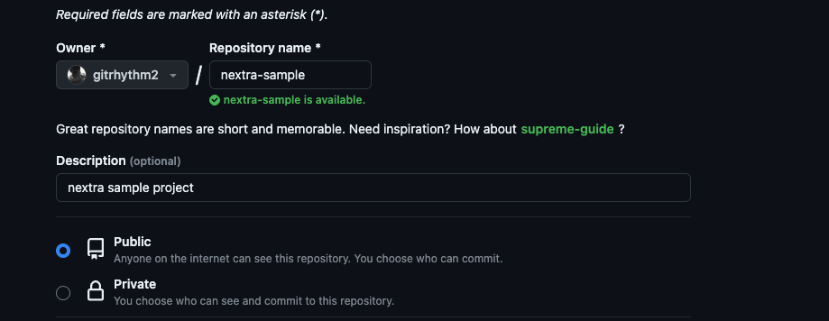

Public / Privateはお好みで。
その他READMEの追加や.gitinogreの追加は、pushしようとしているローカルのnextraプロジェクトに既に存在しているので、これらは作成しないでおく。

`Create repository`ボタンでリポジトリ作成。

### 作成したプロジェクトにpush
リポジトリを作成するとnextra-sampleプロジェクトのページに遷移する。
pushしようとするプロジェクトは既にローカルに存在しているので、`### …or push an existing repository from the command line`の手順を実行する。
```shell copy
git remote add origin https://github.com/gitrhythm2/nextra-sample.git
git branch -M main
git push -u origin main
```

## GitHub - Vercelの連携
GitHubの画面上部右のアイコンをクリックして[Settings]ページを開き、`Integrations - Applications`をクリック。

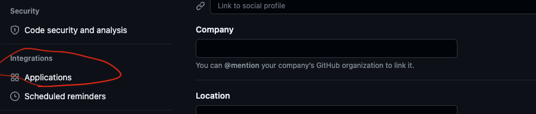

下図の画面に遷移するので、Vercelの`Configure`ボタンをクリック。
<Notis type="caution">
  以前Vercelに別のプロジェクトをデプロイしたことがあるから、何もしなくてもここにVercelが表示されているのかも知れない。
  もし表示されないならば、GitHub / Vercel連携をググってみると何か情報が出てくるかも？
</Notis>

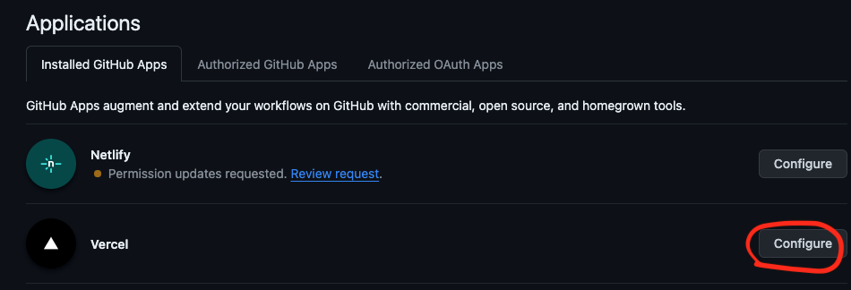

`Repository access`の`Only select repositories`から`nextra-sample`を選択する。

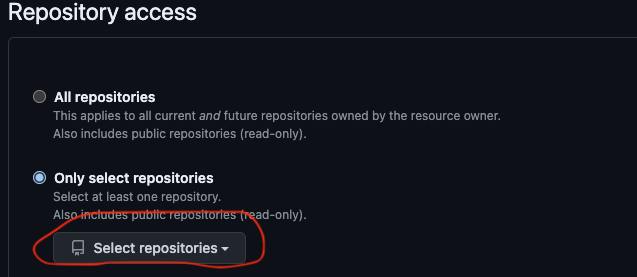

`Save`ボタンをクリックして完了。

## Vercel側の操作
<Notis>
  Vercelにアカウント作成済みであることを前提として話を進める。
</Notis>

https://vercel.com にアクセスし、`Add New...`ボタンから`Project`を選択する。

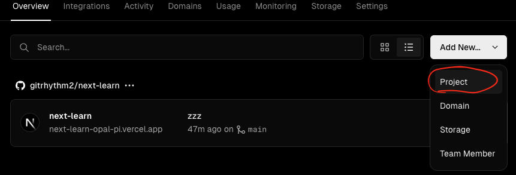

`Let's build something new.`ページに遷移し、nextra-sampleが候補としてリストアップされている。
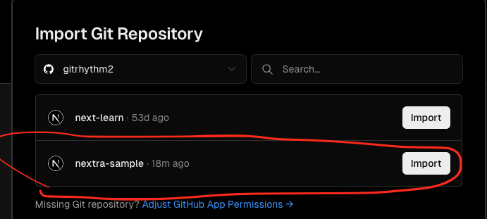

`Import`ボタンをクリックすると`Configure Project`画面に遷移する。
特に変更する項目も無いので`Deploy`ボタンをクリックしてデプロイする。

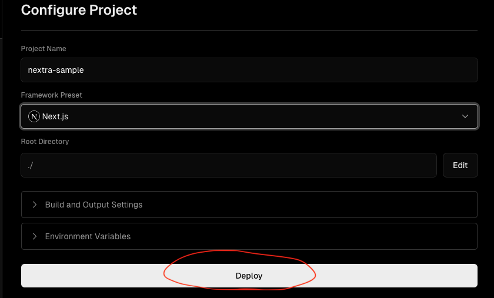

以下のページが表示されればOK。
赤丸の部分をクリックするとデプロイしたページを表示することが出来る。
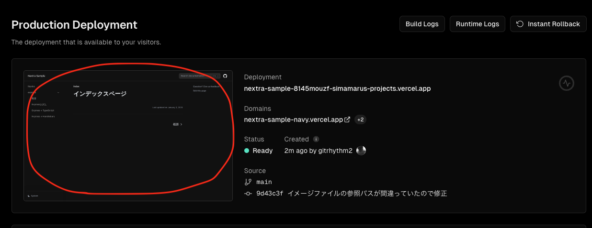

デプロイしたページ: https://nextra-sample-chi.vercel.app/nextra/quick-start
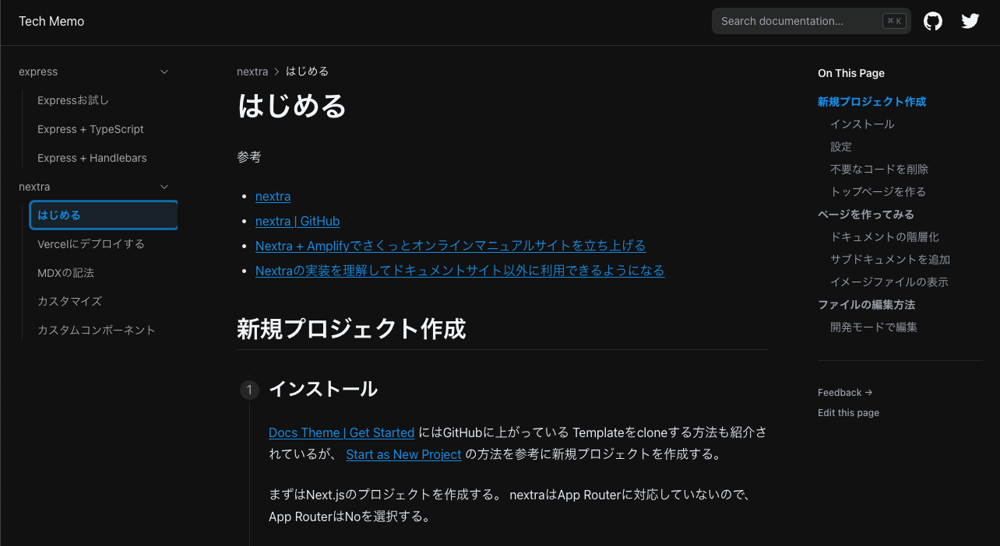

## 削除
Vercelにデプロイしたnextra-sampleの削除、及びGitHubリポジトリの削除をしてみる。

### デプロイの停止
Vercelにデプロイしたnextra-sampleを停止するには以下の操作をする。

https://vercel.com にアクセスし、nextra-sampleを選択。

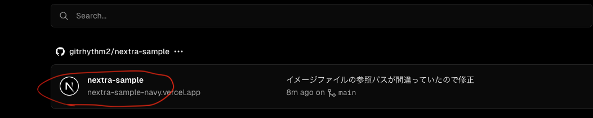

デプロイ情報画面に遷移するので、`Deployments`タブをクリックし、デプロイしたアプリを選択。
下図の`Delete`を選択。
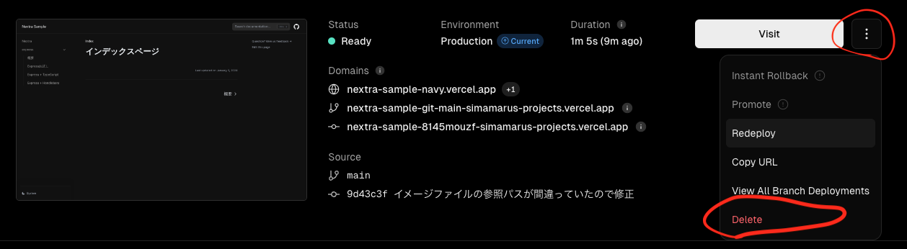
<Notis type='hint'>
  再度デプロイするためには、一旦GitHub側のソースコードを変更しないといけないっぽい(他に方法があるかも知れないけど)

  - ローカルでソースコードを変更
  - Pushする(Pushすると、Vercel側で自動でデプロイ処理が走る)
</Notis>

### Vercel側のプロジェクトの削除
デプロイを停止後、プロジェクトそのものを削除するには、nextra-sampleのSettingsタブを選択し、画面下部の`Delete Project`で削除する。

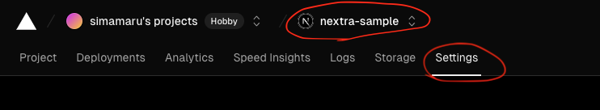

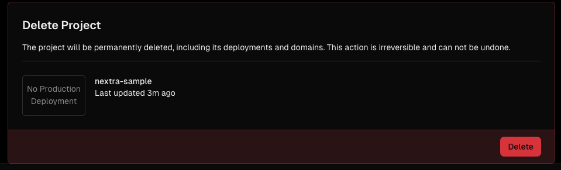

### GitHubリポジトリの削除
GitHubのnextra-sampleプロジェクトのSettingsタブを選択し、画面下部の`Delete this repository`で削除する。
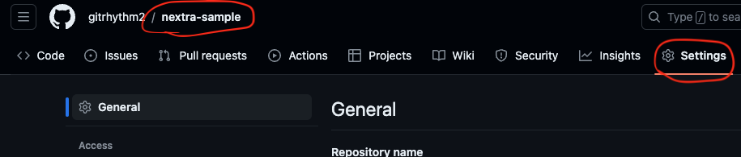

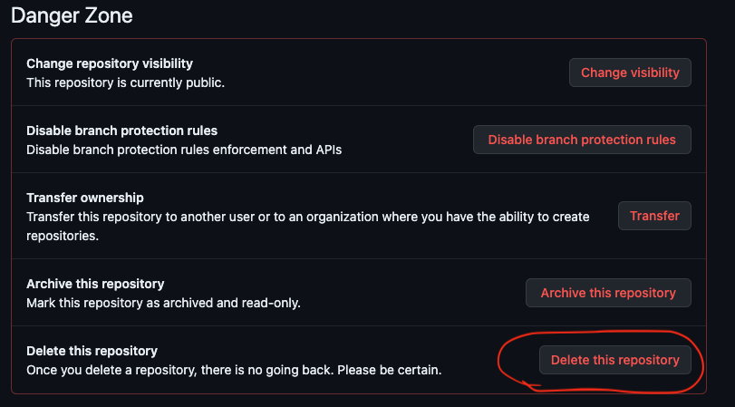
