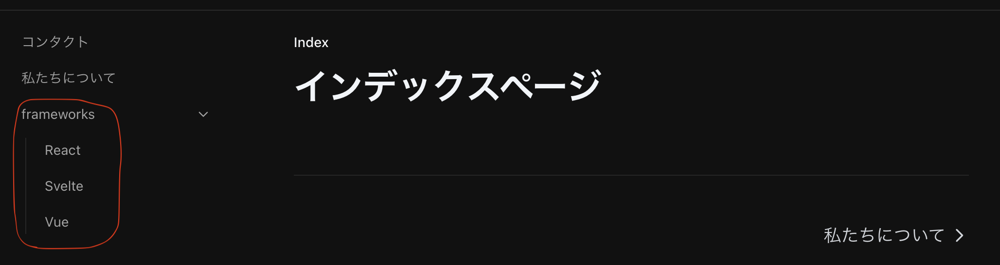
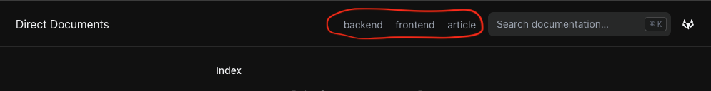

import { FileTree, Steps } from 'nextra/components'
import { Notis } from '@/components/Notis'

# はじめる
参考
- [nextra](https://nextra.site/)
- [nextra | GitHub](https://github.com/shuding/nextra)
- [Nextra + Amplifyでさくっとオンラインマニュアルサイトを立ち上げる](https://zenn.dev/ashizaki/articles/1f39fa156d867e)
- [Nextraの実装を理解してドキュメントサイト以外に利用できるようになる](https://zenn.dev/soata/articles/085fcf674a8978#nextra%E3%81%A8%E3%81%AF)

## 新規プロジェクト作成
<Steps>
### インストール
[Docs Theme | Get Started](https://nextra.site/docs/docs-theme/start) にはGitHubに上がっている
Templateをcloneする方法も紹介されているが、
[Start as New Project](https://nextra.site/docs/docs-theme/start#start-as-new-project)
の方法を参考に新規プロジェクトを作成する。

まずはNext.jsのプロジェクトを作成する。
nextraはApp Routerに対応していないので、App RouterはNoを選択する。
```shell
$ npx create-next-app@latest --src-dir --ts --eslint -- import-alias "@/*"

? Would you like to use Tailwind CSS? › No / Yes # => No
? Would you like to use App Router? (recommended) › No / Yes # => No
```

そして追加でnextraのパッケージをインストール。
```shell copy
$ npm i nextra nextra-theme-docs
```

### 設定
next.config.jsを以下に変更する。
```js copy filename="next.config.js"
const withNextra = require('nextra')({
  theme: 'nextra-theme-docs',
  themeConfig: './theme.config.tsx'
})

module.exports = withNextra()
```

ルート直下にtheme.config.tsxを作成し、以下を追加。
```ts copy filename="theme.config.tsx"
import { DocsThemeConfig } from "nextra-theme-docs";

const config: DocsThemeConfig = {
  logo: <span>Nextra Sample</span>,
  project: {
    link: 'http://localhost:3000',
  }
}

export default config
```

### 不要なコードを削除
Next.jsプロジェクトを作成すると通常のSPAなプロジェクトを生成するけど、nextraではjsxファイルは不要なのでpages配下の
以下のファイルを削除する。
- _document.tsx
- index.tsx

加えて、pages/apiも不要なので削除する。
そして、style/globals.cssを以下に変更する。
```css copy filename="globals.css"
@tailwind base;
@tailwind components;
@tailwind utilities;
```

### トップページを作る
pages/index.mdxを作り、タイトルだけ入れておく。
```md filename="index.mdx"
# インデックスページ
```

`npm run dev`で起動し、インデックスページが表示されればOK。
</Steps>

## ページを作ってみる
まずはインプルに`/`、`/contact`、`/about`ページを作る。
`/`はindex.mdとして既に作成済みなので、残りの2つのページを作る。
```md filename="contact.mdx"
# Contact Page
```

```md filename="about.mdx"
# About Page
```

これらを追加するとナビゲーションエリアにメニューが追加される。
メニューに表示する文字列はファイル名を元にパスカルケースにしたり、ケバブケースの`-`をスペースに変換するなりして表示している。
表示の順番は文字列を昇順でソートしたものになっているので、
[Page Configuration | Pages](https://nextra.site/docs/docs-theme/page-configuration#pages)を参考に
これらを設定で調整する。

pages/_meta.jsonファイルを作成し、以下を追加する。
```json copy filename="_meta.json"
{
  "index": "ホーム",
  "contact": "コンタクト",
  "about": "私たちについて"
}
```

これでメニュー項目の表示順や、表示する文字列をカスタマイズ出来た。

ヘッダー部左のタイトル`Nextra Sample`をクリックしてもインデックスページに遷移するので、
ナビゲーションメニューの`ホーム`は非表示にしたい。そのためにはdisplayにhiddenを指定する。
[Hidden Routes](https://nextra.site/docs/docs-theme/page-configuration#hidden-routes)

```json copy filename="_meta.json"
{
  "index": {
    "display": "hidden"
  },
  "contact": "コンタクト",
  "about": "私たちについて"
}
```

### ドキュメントの階層化
添付画像のように、メニューを階層化したい。

nextraはNext.jsのアプリケーションなので、通常のNext.jsのページを作成する要領でディレクトリを階層化してページを作れば良い。
<FileTree>
  <FileTree.Folder name="src" defaultOpen>
    <FileTree.Folder name="pages" defaultOpen>
      <FileTree.Folder name="frameworks" defaultOpen>
        <FileTree.File name="_meta.json" />
        <FileTree.File name="react.md" />
        <FileTree.File name="svelte.md" />
        <FileTree.File name="vue.md" />
      </FileTree.Folder>
    </FileTree.Folder>
  </FileTree.Folder>
</FileTree>

そしてframeworksディレクトリにも_meta.jsonを作る。
```json copy filename="_meta.json"
{
  "react": "React",
  "---": {   # セパレータを入れる場合はこのようにする
    "type": "separator"
  },
  "svelte": "Svelte",
  "vue": "Vue"
}
```

### サブドキュメントを追加
例えばドキュメントサイトとして`project-doc`があり、`backend`と`frontend`のドキュメントを管理し、
ヘッダー部にサブドキュメントのメニューを表示したいとする。



この場合はルート直下の_meta.jsonにその設定を追加してあげる。
ここまで作成したページは不要なので、`contact.md`、`about.md`、`frameworks`ディレクトリを削除する。
その上で、次のページを追加する。
<FileTree>
  <FileTree.Folder name="src" defaultOpen>
    <FileTree.Folder name="pages" defaultOpen>
      <FileTree.Folder name="backend" defaultOpen>
        <FileTree.File name="overview.mdx" />
      </FileTree.Folder>
      <FileTree.Folder name="frontend" defaultOpen>
        <FileTree.File name="overview.mdx" />
      </FileTree.Folder>
    </FileTree.Folder>
  </FileTree.Folder>
</FileTree>

_meta.jsonにこれらのディレクトリ情報をオブジェクトとして追加する。
```json copy filename="_meta.json"
{
  "index": {
    "display": "hidden"
  },
  "backend": {
    "title": "backend",
    "type": "page"
  },
  "frontend": {
    "title": "frontend",
    "type": "page"
  }
}
```

このようにすれば、backendとfrontendがヘッダー部に表示される。

### イメージファイルの表示
イメージファイルの表示は、通常のNext.jsアプリと同じ考え方になる。つまり、publicディレクトリにイメージファイルを置き、
そのファイルをページ側で参照する形になる。
<Notis>
  pagesディレクトリに置くこともできる。
</Notis>

<FileTree>
  <FileTree.Folder name="public" defaultOpen>
    <FileTree.Folder name="frontend" defaultOpen>
      <FileTree.File name="dir.png" />
    </FileTree.Folder>
  </FileTree.Folder>
</FileTree>

ページ側
```ts


// または、next/imageを使う

import Image from 'next/image'
<Image src="/frontend/overview/dir.png" alt="Hello" width={350} height={350} />
```

## ファイルの編集方法
nextraはマークダウンファイルを表示することに特化していて編集機能は提供していない。したがってマークダウンファイルの編集は
別途考えなければならない。

### 開発モードで編集
nextraプロジェクトを`npm run dev`で立ち上げると開発モードで起動し、ファイルを編集する都度画面が更新されるので、
ドキュメントを修正する場合はこの方法で修正すると、都度表示結果を確認できる。
